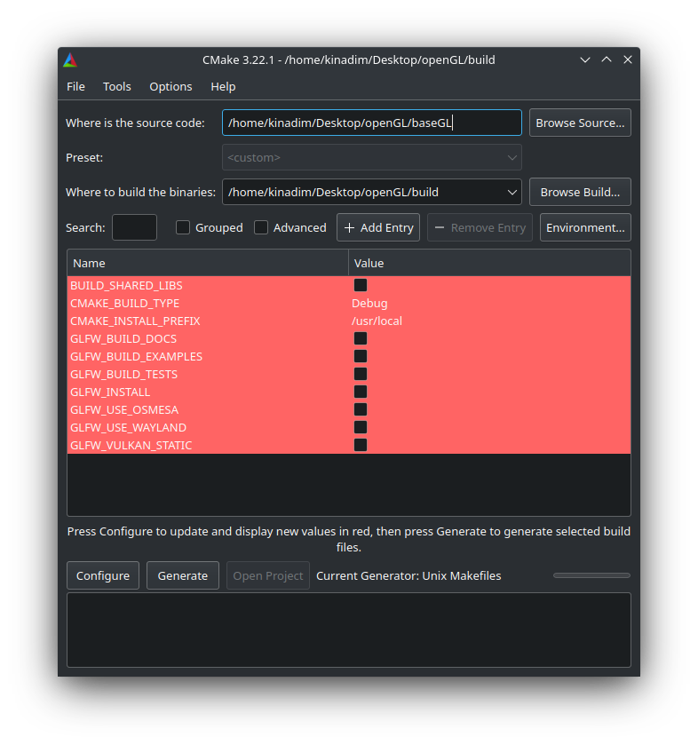
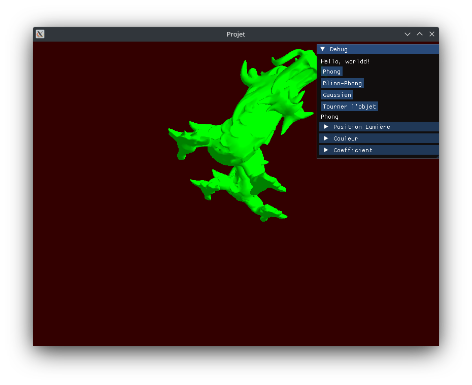
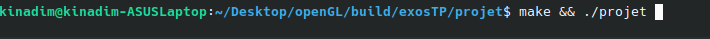

# Projet OpenGL

Ce projet d'openGL dans la matière R5.A.05 présente un démonstrateur pédagogique illustrant les deux axes suivant :

1. Chargement d'un objet stocké au format `obj` (sans `assimp` et consort) - ★★★☆☆
   Charger une géométrie stockée au format `obj`, avec des données pour les sommets, les normales et les coordonnées de texture, et la préparer afin de pouvoir y appliquer une texture.
2. Comparaison des modèles d'illumination utilisant l'ombrage de Phong - ★★☆☆☆
   Phong, Blinn-Phong, Gaussian.

## Table des matières

- [Installation](#installation)
- [Compilation](#compilation)
- [Utilisation](#utilisation)
- [Contribuer](#contribuer)
- [Licence](#licence)

## Installation

Pour configurer le projet il suffit d'installer *cmake. Une fois installé lancez cmake via la recherche ou bien vie commande line:*

`cmake-gui`

Une fois lancé il faudra choisir le code source du projet qui se trouve dans le ce dossier ainsi que l'endroit où vous souhaitez le build.

Ensuite cliquez sur  les boutons "*Configure"*, attendez puis cliquez sur "*Generate".*



## Compilation

Pour compiler le projet il suffit de ce rendre dans le dossier build que vous avez choisi précédement, compilez tout via `make` , puis ce rendre dans le dossier exosTP, et enfin dans le dossier projet recompilez et lancez l'éxécutable projet :
`make && ./projet`

## Utilisation

Dans la petite fenêtre à droite se trouve les paramètres du dragon :

- Si on clique sur ***Blinn-Phong*** on change de modèle d' ombrage vers le modèle Blinn-phong
- Si on clique sur ***Phong*** on change de modèle d' ombrage vers le modèle Phong (c'est le modèle d'ombrage par défaut).
- Si on clique sur ***Gaussien*** on change de modèle d' ombrage vers le modèle Gaussien
- SI on clique sur ***Tourner l'objet*** alors il s'arrêtera s'il tournais déjà et inversement.
- Dans le menu *Position Lumière* se trouvé les coordonnée en x, y et z de la lumière pouvant être modifié.
- Dans le menu *Couleur* se trouve la couleur du dragon ainsi que celle de la lumière modifiable.
- Dans Coefficient se trouve la ***Force Ambient***, la ***Brillance*** et le ***coefficient Gaussien*** *tout 3 modifiables.*



Si l'on souhaite chargé un autre objet il suffit de placé le fichier au format **.obj** et inscrire sont nom dans le code.

Placez le fichier ***.obj*** :

```bash
baseGL/exosTP/projet/resources/objets/
```

Pour cela ouvrez le fichier "*main.cpp"* qui se trouve dans l'arborécence suivante :

```bash
baseGL/exosTP/projet/src/main.cpp
```

au niveau de la ligne 188 du programme changer le path faite le correspondre avec le nom de votre fichier.

Exemple :

```cpp
objet_file.open(std::string(_resources_directory).append("objets/dragon2_small.obj").c_str());
```

À remplacer par :

```cpp
objet_file.open(std::string(_resources_directory).append("objets/bunny.obj").c_str());
```

Pour finir recompilez votre programme dans le dossier build:


## Licence

MIT License

Copyright (c) 2024 Nadim DOUHANE

Permission is hereby granted, free of charge, to any person obtaining a copy
of this software and associated documentation files (the "Software"), to deal
in the Software without restriction, including without limitation the rights
to use, copy, modify, merge, publish, distribute, sublicense, and/or sell
copies of the Software, and to permit persons to whom the Software is
furnished to do so, subject to the following conditions:

The above copyright notice and this permission notice shall be included in
all copies or substantial portions of the Software.

THE SOFTWARE IS PROVIDED "AS IS", WITHOUT WARRANTY OF ANY KIND, EXPRESS OR
IMPLIED, INCLUDING BUT NOT LIMITED TO THE WARRANTIES OF MERCHANTABILITY,
FITNESS FOR A PARTICULAR PURPOSE AND NONINFRINGEMENT. IN NO EVENT SHALL THE
AUTHORS OR COPYRIGHT HOLDERS BE LIABLE FOR ANY CLAIM, DAMAGES OR OTHER
LIABILITY, WHETHER IN AN ACTION OF CONTRACT, TORT OR OTHERWISE, ARISING FROM,
OUT OF OR IN CONNECTION WITH THE SOFTWARE OR THE USE OR OTHER DEALINGS IN
THE SOFTWARE.
